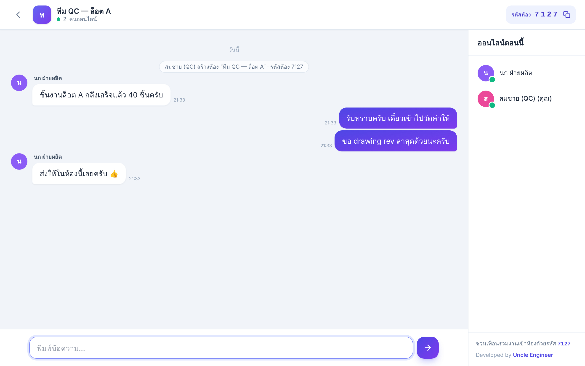
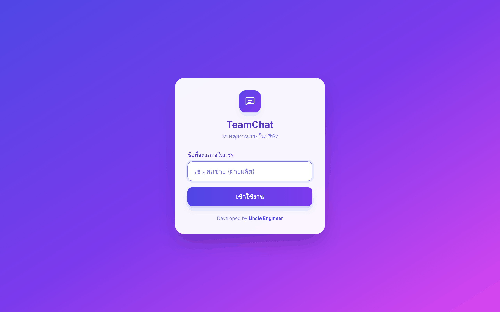
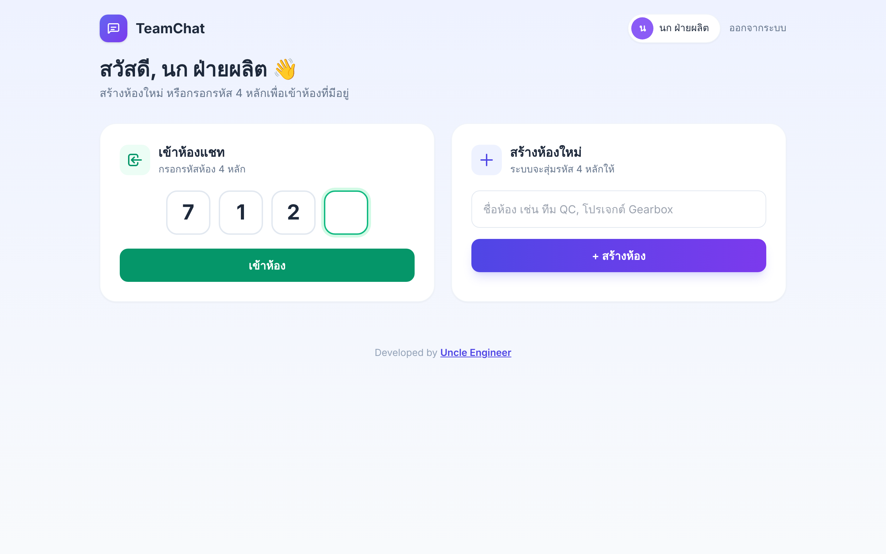
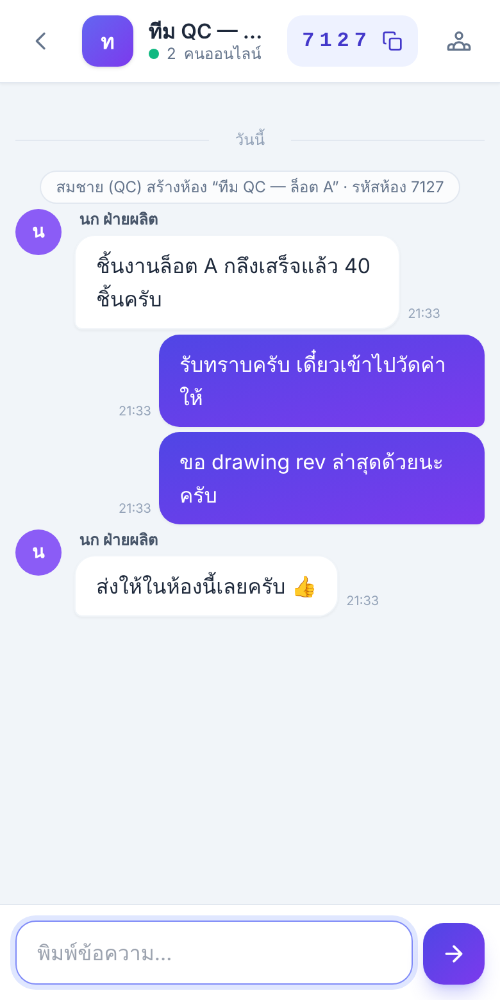

# 💬 TeamChat

**โปรแกรมแชทสำหรับคุยงานภายในบริษัท** เขียนด้วย Flask เป็นไฟล์เดียว (`chat_app.py`) ใช้ Tailwind CSS ทำ UI
สร้างห้องแชทได้ ห้องแต่ละห้องจะได้ **รหัส 4 หลัก** และคนที่จะเข้าห้องต้องกรอกรหัสนั้น

ไม่ต้องตั้งค่าฐานข้อมูล ไม่ต้องมี WebSocket server แยก ติดตั้ง Flask แล้วรันได้เลย



---

## ✨ ฟีเจอร์

- 🔢 **ห้องแชทรหัส 4 หลัก**: ระบบสุ่มรหัสให้เองและไม่ซ้ำกับห้องอื่น (ตั้งแต่ `1000` ถึง `9999`)
- 🚪 **เข้าห้องด้วยรหัส**: กรอกในช่อง 4 ช่อง พอครบจะเข้าห้องเอง วางรหัสทั้งชุดก็ได้
- ⚡ **ข้อความขึ้นเอง**: ดึงข้อความใหม่ทุกประมาณ 1.5 วินาที ไม่ต้องกดรีเฟรช
- 🟢 **ดูได้ว่าใครออนไลน์**: มีรายชื่อคนที่อยู่ในห้องตอนนี้
- 📋 **คัดลอกรหัสห้อง**: กดที่รหัสห้องเพื่อคัดลอกส่งให้เพื่อนร่วมงาน
- 🕘 **ห้องล่าสุด**: หน้าแรกมีลิงก์ไปห้องที่เคยเข้าไว้ พร้อมจำนวนคนออนไลน์
- 💾 **เก็บประวัติแชท**: บันทึกใน SQLite (`chat.db`) ซึ่งระบบสร้างให้เองตอนรันครั้งแรก
- 📱 **ใช้ได้ทั้งคอมและมือถือ**: UI จาก Tailwind CSS กับฟอนต์ IBM Plex Sans Thai
- 📦 **ไฟล์เดียวจบ**: HTML, CSS, JS และ backend อยู่ใน `chat_app.py` ไฟล์เดียว

## 🖼️ ภาพหน้าจอ

| หน้าเข้าสู่ระบบ | หน้าแรก (สร้าง / เข้าห้อง) |
|:---:|:---:|
|  |  |

<p align="center">
  
  <br><em>หน้าห้องแชทบนมือถือ</em>
</p>

## 🚀 การติดตั้งและใช้งาน

ต้องมี **Python 3.8 ขึ้นไป**

```bash
git clone https://github.com/<your-username>/teamchat.git
cd teamchat
pip install -r requirements.txt
python chat_app.py
```

เปิดเบราว์เซอร์ไปที่ `http://localhost:5000`

ถ้าจะให้คนอื่นในวง LAN ของบริษัทใช้ ให้เปิด `http://<IP ของเครื่องที่รัน>:5000` เช่น `http://192.168.1.50:5000`
(โปรแกรม listen ที่ `0.0.0.0` อยู่แล้ว ถ้าเครื่องอื่นเข้าไม่ได้ ให้เช็กว่า firewall เปิดพอร์ต 5000 หรือยัง)

### วิธีใช้

1. **ตั้งชื่อ**ที่จะแสดงในแชท
2. **สร้างห้องใหม่**: ตั้งชื่อห้องแล้วกด "สร้างห้อง" ระบบจะสุ่มรหัส 4 หลักให้
3. **ส่งรหัสห้อง**ให้เพื่อนร่วมงาน
4. **เข้าห้อง**: เพื่อนกรอกรหัส 4 หลักในหน้าแรกก็เข้าห้องได้
5. พิมพ์ข้อความแล้วกด `Enter` เพื่อส่ง (กด `Shift + Enter` เพื่อขึ้นบรรทัดใหม่)

## ⚙️ การตั้งค่า (Environment Variables)

| ตัวแปร | ค่าเริ่มต้น | คำอธิบาย |
|---|---|---|
| `SECRET_KEY` | `change-this-secret-key` | คีย์สำหรับเข้ารหัส session **ควรเปลี่ยนก่อนใช้งานจริง** |
| `CHAT_DB` | `chat.db` | path ของไฟล์ฐานข้อมูล SQLite |
| `PORT` | `5000` | พอร์ตที่ให้เซิร์ฟเวอร์รัน |

ตัวอย่าง:

```bash
# Linux / macOS
SECRET_KEY="my-long-random-secret" PORT=8080 python chat_app.py

# Windows (PowerShell)
$env:SECRET_KEY="my-long-random-secret"; $env:PORT="8080"; python chat_app.py
```

## 🧱 โครงสร้างโปรเจกต์

```
teamchat/
├── chat_app.py        # โปรแกรมทั้งหมด (Flask + HTML/Tailwind + JS)
├── requirements.txt
├── screenshots/       # ภาพประกอบ README
└── chat.db            # ฐานข้อมูล (สร้างอัตโนมัติ ไม่ต้อง commit)
```

### Tech stack

- **Backend**: [Flask](https://flask.palletsprojects.com/) + SQLite (มากับ Python อยู่แล้ว)
- **Frontend**: [Tailwind CSS](https://tailwindcss.com/) ผ่าน Play CDN, JavaScript ล้วน ไม่ใช้ framework
- **Real-time**: ใช้ HTTP polling จึงไม่ต้องติดตั้ง Socket.IO หรือ server เพิ่ม

### API

| Method | Endpoint | คำอธิบาย |
|---|---|---|
| `GET` | `/api/room/<code>/messages?after=<id>` | ดึงข้อความที่ id มากกว่า `after` พร้อมรายชื่อคนออนไลน์ |
| `POST` | `/api/room/<code>/messages` | ส่งข้อความ (JSON: `{"body": "..."}`) |

## ⚠️ ข้อควรรู้

- **ต้องต่ออินเทอร์เน็ต**เพื่อโหลด Tailwind CSS และฟอนต์จาก CDN ถ้าไม่มีเน็ต โปรแกรมยังใช้ได้แต่หน้าตาจะไม่มีสไตล์
- **ไม่มีระบบรหัสผ่าน**: ใครรู้รหัสห้องก็เข้าได้ และหลายคนตั้งชื่อซ้ำกันได้ จึงเหมาะกับใช้ในเครือข่ายภายในบริษัท ไม่ควรเปิดออกอินเทอร์เน็ตตรงๆ
- เซิร์ฟเวอร์ที่ใช้คือ development server ของ Flask ซึ่งพอสำหรับทีมขนาดเล็กถึงกลาง ถ้ามีผู้ใช้เยอะ แนะนำให้รันผ่าน `waitress` หรือ `gunicorn`

```bash
pip install waitress
waitress-serve --host 0.0.0.0 --port 5000 chat_app:app
```

## 🗺️ ฟีเจอร์ที่อาจทำต่อ

- [ ] ส่งรูปและไฟล์ในแชท
- [ ] ตั้งรหัสผ่านห้อง
- [ ] แจ้งเตือนเมื่อมีข้อความใหม่ (Browser Notification)
- [ ] ระบบบัญชีผู้ใช้ / Login

---

<p align="center">
  Developed by <a href="https://uncle-engineer.com/"><strong>Uncle Engineer</strong></a>
</p>
